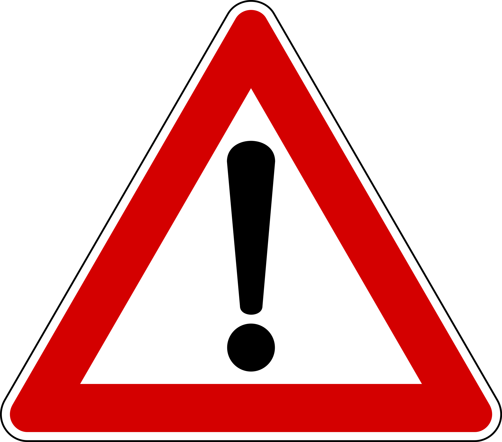
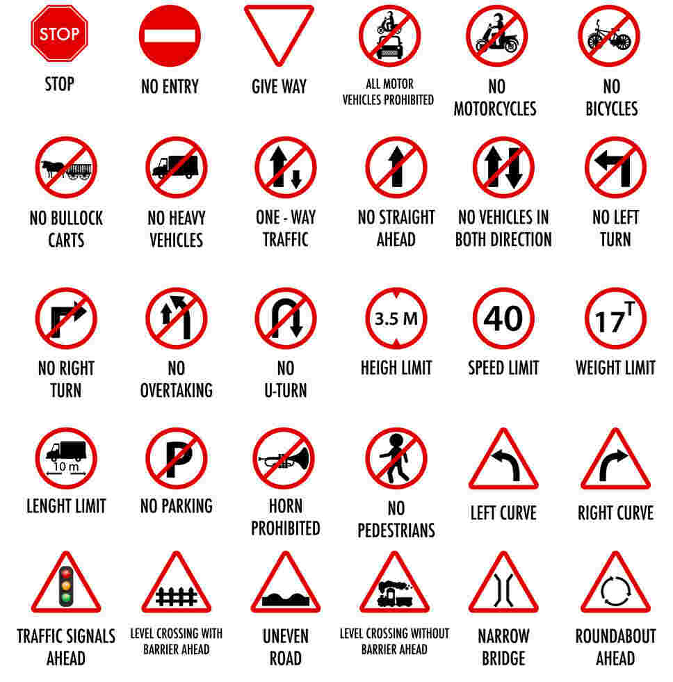
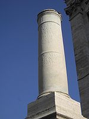
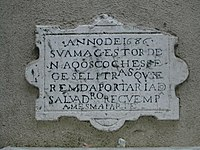
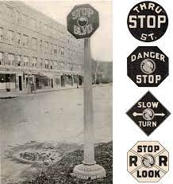
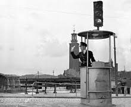

<!-- _backgroundColor: aquq -->

<!-- _color: orange -->

<!-- paginate: false -->

## How To Drive

### Week-1 (Understanding traffic signs)

#### Spring Semester, 2022-2023

Download [DOC](week-1.en.md_doc.pdf), [SLIDE](week-1.en.md_slide.pdf), [PPTX](week-1.en.md_slide.pptx)

<iframe width=700, height=500 frameBorder=0 src="../week-1.en.md_slide.html"></iframe>

---

<!-- paginate: true -->

### In this lecture we will learn

- Traffic signs
- History of traffic signs
- Their meanings
- Their importance

---

## **Traffic signs**

---

### Traffic signs

- **What is traffic sign?**
  
  - Traffic signs or road signs are signs erected at the side of or above roads to give instructions or provide information to road users.
  - The earliest signs were simple wooden or stone milestones. 
  - but also the leap into electronic typesetting, remaining essentially unchanged. 
  - Later, signs with directional arms were introduced, for example the fingerposts in the United Kingdom and their wooden counterparts in Saxony.

---

- **What is traffic sign?**
  Traffic signs can be grouped into several types. For example, Annexe 1 of the Vienna Convention on Road Signs and Signals (1968), which on 30 June 2004 had 52 signatory countries, defines eight categories of signs:

---

- **Categories of signs**
  A. Danger warning signs
  B. Priority signs
  C. Prohibitory or restrictive signs
  D. Mandatory signs
  E. Special regulation signs
  F. Information, facilities, or service signs
  G. Direction, position, or indication signs
  H. Additional panels

---

### History

The earliest road signs were milestones, giving distance or direction; for example, the Romans erected stone columns throughout their empire giving the distance to Rome. According to Strabo, Mauryas erected signboards at distance of 10 stades to mark their roads. In the Middle Ages, multidirectional signs at intersections became common, giving directions to cities and towns.

---

### History

In 1686, the first known Traffic Regulation Act in Europe was established by King Peter II of Portugal. This act foresaw the placement of priority signs in the narrowest streets of Lisbon, stating which traffic should back up to give way. One of these signs still exists at Salvador street, in the neighborhood of Alfama.

---

### History

The first modern road signs erected on a wide scale were designed for riders of high or "ordinary" bicycles in the late 1870s and early 1880s. These machines were fast, silent and their nature made them difficult to control, moreover their riders travelled considerable distances and often preferred to tour on unfamiliar roads. 

---

### History

For such riders, cycling organizations began to erect signs that warned of potential hazards ahead (particularly steep hills), rather than merely giving distance or directions to places, thereby contributing the sign type that defines "modern" traffic signs.  

---

### History

The development of automobiles encouraged more complex signage systems using more than just text-based notices. One of the first modern-day road sign systems was devised by the Italian Touring Club in 1895. By 1900, a Congress of the International League of Touring Organizations in Paris was considering proposals for standardization of road signage. In 1903 the British government introduced four "national" signs based on shape, but the basic patterns of most traffic signs were set at the 1908 International Road Congress in Paris. 

---

### History

In 1909, nine European governments agreed on the use of four pictorial symbols, indicating "bump", "curve", "intersection", and "grade-level railroad crossing". The intensive work on international road signs that took place between 1926 and 1949 eventually led to the development of the European road sign system. Both Britain and the United States developed their own road signage systems, both of which were adopted or modified by many other nations in their respective spheres of influence. The UK adopted a version of the European road signs in 1964 and, over past decades, North American signage began using some symbols and graphics mixed in with English.

---

### History

In the U.S., the first road signs were erected by the American Automobile Association (AAA). Starting in 1906, regional AAA clubs began paying for and installing wooden signs to help motorists find their way. In 1914, AAA started a cohesive transcontinental signage project, installing more than 4,000 signs in one stretch between Los Angeles and Kansas City alone.

---

### History

Over the years, change was gradual. Pre-industrial signs were stone or wood, but with the development of Darby's method of smelting iron using coke-painted cast iron became favoured in the late 18th and 19th centuries. Cast iron continued to be used until the mid-20th century, but it was gradually displaced by aluminium or other materials and processes, such as vitreous enamelled and/or pressed malleable iron, or (later) steel. Since 1945 most signs have been made from sheet aluminium with adhesive plastic coatings; these are normally retroreflective for nighttime and low-light visibility. Before the development of reflective plastics, reflectivity was provided by glass reflectors set into the lettering and symbols.

---

### History

New generations of traffic signs based on electronic displays can also change their text (or, in some countries, symbols) to provide for "intelligent control" linked to automated traffic sensors or remote manual input. In over 20 countries, real-time Traffic Message Channel incident warnings are conveyed directly to vehicle navigation systems using inaudible signals carried via FM radio, 3G cellular data and satellite broadcasts. Finally, cars can pay tolls and trucks pass safety screening checks using video numberplate scanning, or RFID transponders in windshields linked to antennae over the road, in support of on-board signalling, toll collection, and travel time monitoring.

---

### History

Yet another "medium" for transferring information ordinarily associated with visible signs is RIAS (Remote Infrared Audible Signage), e.g., "talking signs" for print-handicapped (including blind/low-vision/illiterate) people. These are infra-red transmitters serving the same purpose as the usual graphic signs when received by an appropriate device such as a hand-held receiver or one built into a cell phone.

---

### History

Then, finally, in 1914, the world's first electric traffic signal is put into place on the corner of Euclid Avenue and East 105th Street in Cleveland, Ohio, on August 5.

---

## Meanings of traffic signs (In Turkey)
Traffic signs come in a variety of shapes and colours, and each has a specific meaning. The different shapes and colours are there to help you identify a sign as quickly as possible, without interrupting your driving.

---

According to the Road Traffic Management Corporation, the various road traffic signs are classified into four main groups and sub-categories, for example:

- Warning: Road Layout/Direction of Movement
- Regulatory: Control/Command/Prohibition/Reservation
- Guidance: Location/Route Markers/Direction
- Temporary: Command/Prohibition
---

### Warning signs 

---

### Warning signs 

---

### Regulatory signs 

---

### Guidance signs 

---

### Guidance signs 

---

### Guidance signs 

---

### Additional signs 

---

## Why traffic signs are important?

Traffic signs provide valuable information to drivers and other road users. They represent rules that are in place to keep you safe, and help to communicate messages to drivers and pedestrians that can maintain order and reduce accidents. Neglecting them can be dangerous.

Most signs make use of pictures, rather than words, so that they are easy to understand and can be interpreted by people who speak a variety of languages. For this reason, it’s important that you know what each picture represents, and that you use them to inform your driving. Failing to do so could result in a serious accident or a fine.

---

## References

- https://en.wikipedia.org/wiki/Traffic_sign
- https://en.wikipedia.org/wiki/Road_signs_in_Turkey
- https://www.supaquick.com/blog/traffic-signs-for-road-safety#:~:text=Traffic%20signs%20provide%20valuable%20information,maintain%20order%20and%20reduce%20accidents.

---

$End-Of-Week-1$
