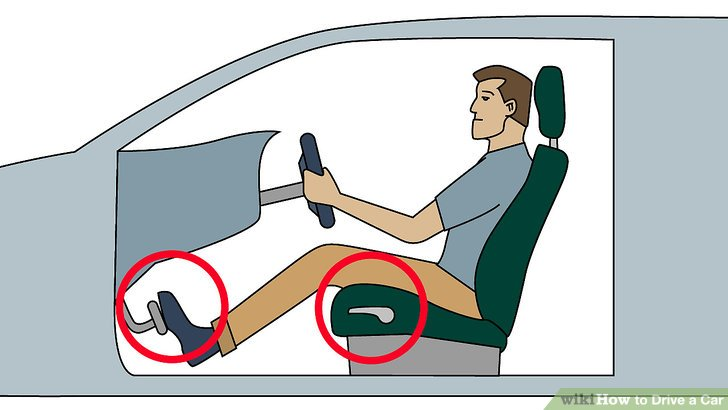
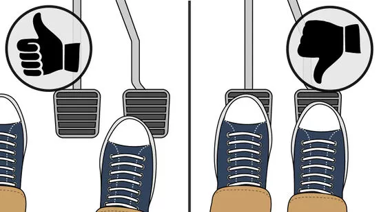
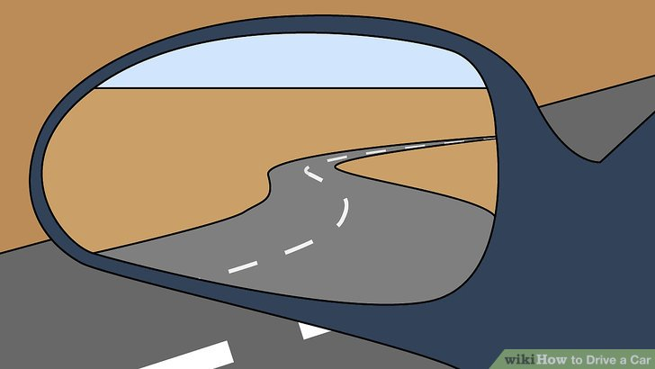
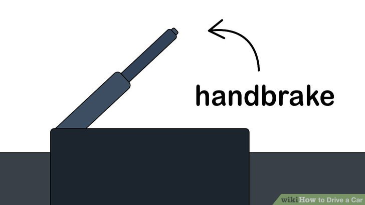
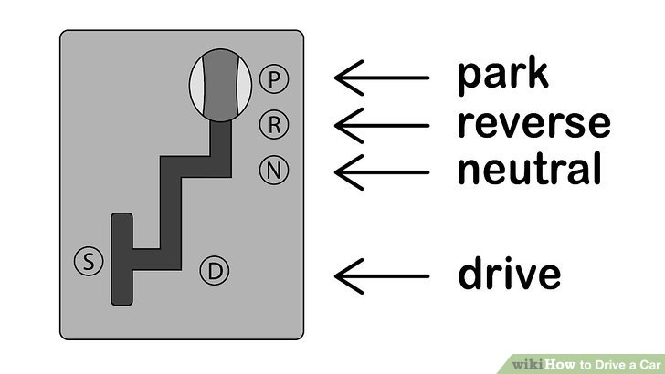
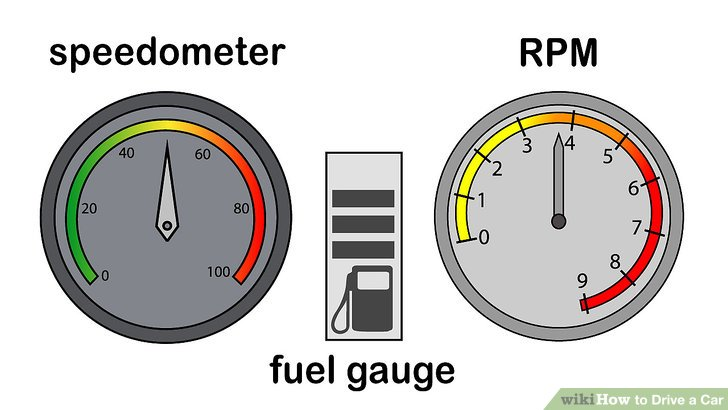

<!-- _backgroundColor: aquq -->

<!-- _color: orange -->

<!-- paginate: false -->

## Sample Course Name

### Week-2 (Getting prepared)

#### Spring Semester, 2022-2023

Download [DOC](week-2.en.md_doc.pdf), [SLIDE](week-2.en.md_slide.pdf), [PPTX](week-2.en.md_slide.pptx)

<iframe width=700, height=500 frameBorder=0 src="../week-2.en.md_slide.html"></iframe>

---

<!-- paginate: true -->

### In this lecture we will learn

- Getting prepared to use car

---

## **Getting Comfortable with the Car's Controls**

---

### Adjust the seat so that your feet comfortably reach both pedals.

You can adjust your seat forward and backward, as well as up and down. Some cars will have electronic controls (usually on the left side of the seat), while older cars will usually have a lever underneath the seat that lets you control the position of the seat. But you can usually tell the difference.

---

### Familiarize yourself with the foot pedals.

In an automatic car, the two-foot pedals control acceleration and braking, respectively. The rightmost pedal (which is usually smaller than the other pedal) is the accelerator, and pressing down on it makes the car move; the harder you press down on it, the faster the car will move. The pedal to the left, which is usually larger than the accelerator; is the brake pedal, and pressing down on it slows the car down.

---

- Even if you feel more confident using your left foot, always use your right foot to reach both pedals. It will feel strange at first if you're left-footed, but getting used to it is very important because it's proper technique and ultimately much safer.
- Never use both feet at once to reach the pedals. Only use one foot — your right foot — to use each pedal. This will make it impossible to accidentally press down on both pedals at the same time, which can be dangerous and can damage your car.

---

### Adjust your car's mirrors so that you can see through them clearly and effectively.

Your car should have three mirrors: one rear-view mirror, which allows you to see directly the rear windshield behind you, and two outside mirrors which let you see to either side of the car and protect you from blind spots.
- Your rear-view mirror should be positioned so that when you're in your normal driving position, you can see directly behind you and as much of the rear windshield as possible.

---

- The Society of Automotive Engineers has one recommendation for how to position your outside mirrors in order to eliminate blind spots. It recommends positioning the mirrors further outward than normal, so that they just overlap with the viewing angle of the rear-view mirror. Although disorienting at first, this positioning actually allows the driver to see cars in their blind spots which they might otherwise only be able to spot by looking over their shoulder.

---

### Know where the parking brake (also called a handbrake, e-brake or emergency brake) is and what it does.

The parking brake is a longer lever with a button on the very tip of it. When the parking brake is pulled up, it helps lock the car into place on the ground, ensuring that it doesn't move. When the brake is let down, it is disengaged and the car can freely move. Make sure that your parking brake is disengaged before you start driving.

---

### Get a feel for the gear stick (also called shift lever, gear lever, shifter or simply, "the stick")

he gear stick is usually positioned in between the two front seats of a car, and it controls the gearbox (park, neutral, drive, reverse). Sometimes in certain vehicles, the shift lever is on the right side of the steering wheel.
- If your gear stick is engaged in Park and you turn your ignition on, the car won't move forward no matter how hard you press down on the accelerator.
- If your gear stick is in Neutral, your car's natural momentum will continue to move it forward.

---

- If your gear stick is in Reverse, your car will move backward instead of forward when you take your foot off the brake.
- If your gear stick is in Drive, your car will move forwards when you take your foot off the brake.
- In most modern vehicles, the lever is either in a straight line on the right side of the driver or is a lever on the steering wheel. The "lever" may actually be a knob depending on your car. If you're stuck, read the owners manual when you have the time.

---

### Understand the basic dashboard controls/symbols.

These gauges display to the driver how much fuel the engine has left, how fast the car is going, how hot the engine is, and how many RPM (revolutions per minute) the engine is clocking.
- The speedometer is probably the most important dashboard display in the car. It tells you how fast your car is traveling, in either miles per hour (mph) or kilometers per hour (kph).
- The RPM gauge tells you how hard your engine is working. Most RPM gauges will have red areas starting at 6,000 or 7,000 RPM. When the dial in the gauge, travels into the red, learn to ease off the acceleration.

---

- The fuel gauge tells you how much fuel your car has left. It usually has a dial, like the hand of a clock that travels between "F" and "E," with "E" signaling "empty" and "F" signaling "full." Some more modern cars have digital fuel gauges; where electronic bars are displayed like the battery symbol on a mobile phone, and gradually decrease in quantity depending on how much fuel is in the car.
- The temperature gauge in the car tells you whether your car's engine is overheating. It usually has a dial that travels between "H" and "C," signaling "hot" and "cold." Your dial should normally be in the center of the gauge.

---

## References

- https://www.wikihow.com/Drive-a-Car

---

$End-Of-Week-2-$
